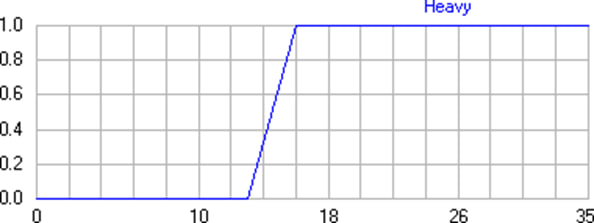
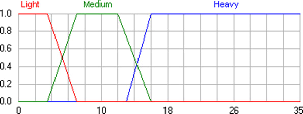
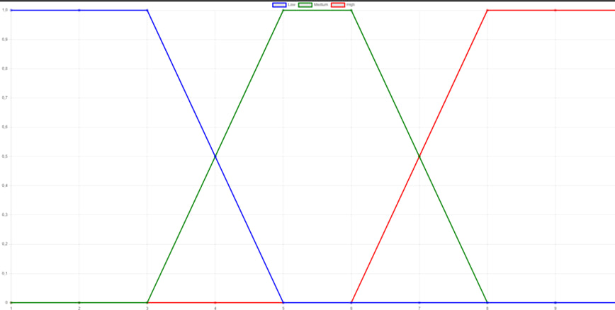

## Алгоритм Мамдани в системах нечеткого вывода

Прежде чем начать знакомство с алгоритмом важно кратко ознакомиться со следующими определениями:

Нечеткая переменная – это кортеж вида < 𝛼, 𝑋, 𝐴 >, где:

𝛼 – имя нечеткой переменной;

𝑋 – ее область определения;

𝐴 – нечеткое множество на универсуме 𝑋
___
### Пример

Нечеткая переменная 

<”Тяжелый бронежилет”, {0кг < x < 35кг},
𝐵 = {𝑥, 𝜇(𝑥)}>	

характеризует	массу	бронежилета.	Бронежилет	будет тяжелым, если масса > 16кг.

График функции принадлежности 𝜇(𝑥) для нечеткого множества 𝐵 



Лингвистическая переменная это кортеж < 𝛽, 𝑇, 𝑋, 𝐺, 𝑀 >, где :

𝛽 – имя лингвистической переменной;

𝑇 – множество ее значений (термов);

𝑋 - универсум нечетких переменных;

𝐺 - синтаксическая процедура образования новых термов;

𝑀 - семантическая процедура, формирующая нечеткие множества для каждого терма данной лингвистической переменной.

Допустим, мы имеем субъективную оценку массы бронежилета. Она, например, может быть получена от военнослужащих (выступающих в роли экспертов), которые непосредственно имеют дело с подобной амуницией. Формализовать эту оценку можно с помощью следующей лингвистической переменной < 𝛽, 𝑇, 𝑋, 𝐺, 𝑀 >, где

𝛽 – Бронежилет;

𝑇 - {«Легкий бронежилет (Light)», «Бронежилет средней массы (Medium)»,
«Тяжелый бронежилет (Heavy)»};

𝑋 – [0; 35];

𝐺 - процедура образования новых термов при помощи логических связок и модификаторов. Например, «очень тяжелый бронежилет»;

𝑀 – процедура задания на универсуме 𝑋 = [0; 35] значений лингвистической переменной, то есть термов из множества 𝑇

Графики функций принадлежности значений лингвистической переменной
«Бронежилет»



Нечетким высказыванием будем называть высказывание вида “𝛽 𝐼𝑆 𝛼”, где:

𝛽 - лингвистическая переменная;

𝛼 - один из термов этой переменной.

К примеру «Бронежилет IS легкий». Здесь «Бронежилет» — это лингвистическая переменная, а «легкий» её значение.

Упрощенно говоря, правилом нечетких продукций (далее просто правилом) будем называть классическое правило вида «ЕСЛИ… ТО ...», где в качестве условий и заключений будут использоваться нечеткие высказывания. Записываются такие правила в следующем виде:

                            𝐼𝐹 (𝛽1 𝐼𝑆 𝛼1) 𝐴𝑁𝐷 (𝛽2 𝐼𝑆 𝛼2) 𝑇𝐻𝐸𝑁 (𝛽3 𝐼𝑆 𝛼3)

Пример:
1)	IF (Бронежилет тяжелый) THEN (Солдат уставший);
2)	IF (Температура высока) THEN (Вентилятор на максимуме);
Этого минимума достаточно для понимания принципов работы алгоритма.

### Код

1) Формирование базы правил
Сформируем базу правил как объект, чтобы не прописывать кучу else if или switch-case, в данном случае значения первых трех полей это условия (IF ELSE), а последнее поле это результат (THEN)
```javascript
const rules = [
  {
    quality: "Высокое",
    reviews: "Положительные",
    delivery: "Быстрая",
    decision: "Стоит",
  },
  {
    quality: "Низкое",
    reviews: "Отрицательные",
    delivery: "Долгая",
    decision: "Не стоит",
  },
  {
    quality: "Среднее",
    reviews: "Средние",
    delivery: "Средняя",
    decision: "Стоит еще подумать",
  },
  {
    quality: "Высокое",
    reviews: "Положительные",
    delivery: "Долгая",
    decision: "Стоит",
  },
  {
    quality: "Высокое",
    reviews: "Отрицательные",
    delivery: "Быстрая",
    decision: "Не стоит",
  },
  {
    quality: "Среднее",
    reviews: "Положительные",
    delivery: "Долгая",
    decision: "Стоит еще подумать",
  },
  {
    quality: "Низкое",
    reviews: "Средние",
    delivery: "Долгая",
    decision: "Не стоит",
  },
  {
    quality: "Низкое",
    reviews: "Отрицательные",
    delivery: "Быстрая",
    decision: "Не стоит",
  },
  {
    quality: "Низкое",
    reviews: "Положительные",
    delivery: "Быстрая",
    decision: "Стоит",
  },
  {
    quality: "Низкое",
    reviews: "Положительные",
    delivery: "Средняя",
    decision: "Стоит подумать",
  },
  {
    quality: "Низкое",
    reviews: "Положительные",
    delivery: "Быстрая",
    decision: "Стоит",
  },
  {
    quality: "Среднее",
    reviews: "Положительные",
    delivery: "Средняя",
    decision: "Стоит",
  },
  {
    quality: "Высокое",
    reviews: "Отрицательные",
    delivery: "Долгая",
    decision: "Не стоит",
  },
];

module.exports = rules;

```

2) Фаззификация + расчет степени принадлежности

Рассмотрим функцию классификации параметра качества (для остальных функций оценки отзывов и доставки расчеты будут точно такими же)


```
const classifyQuality = (value) => {
  if (value >= 1 && value <= 5) {
    const low = value <= 3 ? 1 : Math.max(0, (5 - value) / 2);
    const medium = value >= 3 && value <= 5 ? Math.max(0, (value - 3) / 2) : 0;
    const high = 0;

    return {
      Low: low,
      Medium: medium,
      High: high,
    };
  } else if (value > 5 && value <= 7) {
    const low = 0;
    const medium = value <= 6 ? 1 : Math.max(0, (8 - value) / 2);
    const high = value >= 7 ? 0.5 : 0;

    return {
      Low: low,
      Medium: medium,
      High: high,
    };
  } else if (value > 7 && value <= 10) {
    const low = 0;
    const medium = 0;
    const high = 1;

    return {
      Low: low,
      Medium: medium,
      High: high,
    };
  } else {
    return "недопустимое значение";
  }
};
```
Сама функция принимает на вход оценку параметра качества от пользователя, разбивает, относит к какому либо из нечетких множеств (Low, Medium, High) и рассчитывает степень принадлежности к каждому нечеткому множеству.

Также для функций принадлежности построим график
Для этого создадим html файл (визуализация) и подключим библиотеку chart, внутри исполняющего скрипт файла продублируем ранее созданную функцию

```
<script>
      // Функция classifyDelivery
      const classifyDelivery = (value) => {
        if (value >= 1 && value <= 5) {
          const low = value <= 3 ? 1 : Math.max(0, (5 - value) / 2);
          const medium =
            value >= 3 && value <= 5 ? Math.max(0, (value - 3) / 2) : 0;
          const high = 0;

          return {
            Low: low,
            Medium: medium,
            High: high,
          };
        } else if (value > 5 && value <= 7) {
          const low = 0;
          const medium = value <= 6 ? 1 : Math.max(0, (8 - value) / 2);
          const high = Math.max(0, (value - 6) / 2);

          return {
            Low: low,
            Medium: medium,
            High: high,
          };
        } else if (value > 7 && value <= 10) {
          const low = 0;
          const medium = 0;
          const high = 1;

          return {
            Low: low,
            Medium: medium,
            High: high,
          };
        } else {
          return "недопустимое значение";
        }
      };

      // Создание данных для графика
      const dataPoints = [];
      for (let i = 1; i <= 10; i += 1) {
        const result = classifyDelivery(i);
        dataPoints.push({
          x: i,
          yLow: result.Low,
          yMedium: result.Medium,
          yHigh: result.High,
        });
      }

      // Отрисовка графика с помощью Chart.js
      const ctx = document.getElementById("deliveryChart").getContext("2d");
      new Chart(ctx, {
        type: "line",
        data: {
          datasets: [
            {
              label: "Low",
              borderColor: "blue",
              data: dataPoints.map((point) => ({ x: point.x, y: point.yLow })),
              fill: false,
            },
            {
              label: "Medium",
              borderColor: "green",
              data: dataPoints.map((point) => ({
                x: point.x,
                y: point.yMedium,
              })),
              fill: false,
            },
            {
              label: "High",
              borderColor: "red",
              data: dataPoints.map((point) => ({ x: point.x, y: point.yHigh })),
              fill: false,
            },
          ],
        },
        options: {
          scales: {
            x: {
              type: "linear",
              position: "bottom",
            },
            y: {
              type: "linear",
            },
          },
        },
      });
    </script>
```

График:



3) Агрегирование подусловий

Целью этого этапа является определение степени принадлежности условий для каждого правила системы нечеткого вывода. Это уже было сделано в этапе фаззификации

4) Аккумуляция подзаключений

Целью этого этапа является получение нечеткого множества (или их объединения) для каждой из выходных переменных
```
const data = processObject(userRatings);

    const result = {};

    for (const key in data) {
      const subObject = data[key];
      const max = Math.max(...Object.values(subObject));
      const maxKeys = Object.keys(subObject).filter(
        (subKey) => subObject[subKey] === max
      );
      const maxKey = maxKeys[0];
      result[key] = ratingsMap[key][maxKey];
    }
```
В объекте data будет храниться результат вызова функции processObject, в который в качестве аргумента передадим объект с оценками пользователя, т.е. просто сохраним в переменную результат предыдущего этапа.

5) Получение результата на основе базы правил

После предыдущего этапа получили объект с нечеткими множествами и теперь для получения результата сравним полученный объект с объектами,
хранящимися в базе правил. В идеальном случае полученный объект будет полностью соответствовать объекту, указанному в базе правил, но таких случаев немного (12 из 27 возможных), поэтому создаем счетчик для объекта, который будем инкрементировать с каждым совпадением.

```
let bestMatch = null;
    let bestMatchCount = 0;

    for (const rule of rules) {
      let matchCount = 0;
      for (const key in result) {
        if (result[key] === rule[key]) {
          matchCount++;
        }
      }
      if (matchCount > bestMatchCount) {
        bestMatchCount = matchCount;
        bestMatch = rule.decision;
      }
    }
```
В самом коде обойдем все правила, указанные в базе правил и по итогу вернем результат правила с наибольшим совпадением.

Более подробно с работой можно ознакомиться по ссылке
https://drive.google.com/file/d/14ZxUXryQWkfQtd5ku-WLNTSZwOJ86erd/view?usp=sharing
